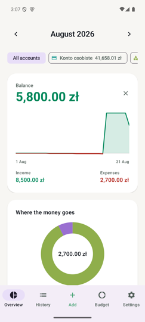

# Monyx

A shared household budget app for one family. Native Android, backend on Telnyx
Edge Compute. English and Polish interface, switchable in Settings.

## Screenshots

<table>
  <tr>
    <td align="center" width="16%"></td>
    <td align="center" width="16%"></td>
    <td align="center" width="16%"></td>
    <td align="center" width="16%"></td>
    <td align="center" width="16%"></td>
    <td align="center" width="16%"></td>
  </tr>
  <tr>
    <td align="center"><b>Add</b><br>the launch screen</td>
    <td align="center"><b>Overview</b><br>where the money goes</td>
    <td align="center"><b>Trend</b><br>how the balance arrived</td>
    <td align="center"><b>History</b><br>search and filter</td>
    <td align="center"><b>Budget</b><br>plan and limits</td>
    <td align="center"><b>Settings</b><br>accounts, categories</td>
  </tr>
</table>

The app opens straight onto the keypad, because entering an expense is the one
thing that decides whether a household is still using this in a month. There is
no system keyboard in that flow: the grid is the amount field, which is also
what makes the calculator possible — `60 +` stays on screen while the second
operand is typed, instead of the running total vanishing the moment you press
an operator.

Committing the expense is a button of its own, the width of the screen, with the
amount already on it. It used to be a filled tick in the corner of the keypad —
exactly where a calculator puts `=`, so the key that ended the entry and the key
that ended the sum were the same shape in the same place. The tick is honestly
`=` now, and when the button cannot save it names what is still missing instead
of sitting there grey.

Tapping the balance turns the card over, and the three figures on it do not
change — the back adds the path, not a second opinion. The line is the month's
balance arriving: payday is the step up, and the long grind down to the next one
is the month being lived. It restarts on the 1st, so the last point on the line
is the number printed on the front; the thirty days reach back into the month
before, drawn as their own run with a break at the turn, because a balance does
not slide from last month's total down to zero overnight. Green above break-even,
red below, cut at the zero line rather than coloured by wherever the month
happens to end — a month that dipped under and recovered says so. Touching the
line answers what the balance was on that evening and what moved on the day;
dragging along it walks the month. Every day is a vertex even when nothing
happened on it, and the line is never smoothed, because a curve fitted between
two points invents balances the household never had.

One month, an arrow either side, and the same control in the same place on
Overview, History and Budget. History used to choose its period from a dropdown
that stopped six months back; the arrows have no floor, and every one of the
three screens is scoped to a month it always has.

Interface English, category names Polish: the names are rows that sync to every
device, so they are data the family owns, not translated copy. Switching the
interface language does not rename anyone's categories.

Captured on an emulator against a local database of demo data — not the
family's own numbers.

## Layout

```
monyx/
├── server/          Telnyx Edge Compute function (TypeScript)
├── android/         The app (Kotlin, Compose, Room)
├── scripts/         One-off operational scripts
└── docs/decisions/  ADRs — written when something surprised us
```

## Prerequisites

- Node ≥ 22.5 (for `node:sqlite` and `node --test`)
- `telnyx-edge` CLI ≥ 0.5.0 — below that the `sqldb` surface differs
- JDK 17+ and the Android SDK (platform 35, build-tools 35) for the app

## Server

```sh
cd server
npm install
npm test          # 51 tests: the sync protocol and the budget alert path
npm run typecheck
telnyx-edge ship  # deploy
```

Bindings live in `telnyx.toml` and are read via
`import { env } from "@telnyx/edge-runtime"` — **never** off the second argument
to `fetch(req, env)`, which type-checks cleanly and is `undefined` at runtime.

### Schema changes

Migrations are numbered and untouchable once applied. A fix is a **new file**,
never an edit to an old one.

```sh
telnyx-edge storage sqldb migrations apply monyx --remote --migrations-dir server/migrations
```

### Creating a household

There is no endpoint that creates a household — enrolment consumes an invite, it
does not bootstrap. Use the script, which seeds the default categories and
accounts and mints the first invite code in one go:

```sh
node scripts/new-household.mjs "Dom"            # Polish seed names
node scripts/new-household.mjs "Home" --lang en  # English seed names
```

`--lang` picks the language of the SEED ROWS only, and only once. Category and
account names are data that syncs to every device; the in-app language picker
changes the interface around them, not the names themselves. That is deliberate
— the family renames these anyway, and a rename must not be undone by somebody
else switching language.

It prints the `household_id` and an invite code valid for 24 hours. Type that
code into the app's onboarding screen. After that, any enrolled phone can mint
further invites from Settings.

## Android

```sh
cd android
./gradlew assembleDebug     # use the wrapper: it pins Gradle 8.11.1, and
                            # AGP 8.7.3 does not support Gradle 9
./gradlew assembleRelease   # signed, R8-minified, shrinkResources on
```

Debug builds carry `applicationIdSuffix ".debug"` so a debug and a release build
coexist on one phone. Without it the eventual release install fails with
`INSTALL_FAILED_UPDATE_INCOMPATIBLE`, and the only way through is an uninstall
that destroys local data.

`versionCode` is derived from `git rev-list --count HEAD`. **Android refuses any
APK whose versionCode is lower than the installed one**, so a bad release cannot
be rolled back without an uninstall. Settings shows `versionName (versionCode)`
so "which build do you have?" is answerable over the phone.

### The release keystore

`android/keystore.properties` (git-ignored) points at `~/.monyx/monyx-release.jks`.

**Back up both the keystore and its password somewhere that survives a laptop
dying.** Android refuses an update signed with a different key than the installed
build. Losing the keystore means every phone must uninstall and reinstall,
losing anything not yet synced.

## Languages

English is the source and the default (`res/values/`); Polish is a translation
(`res/values-pl/`). Settings › Language offers System default, English, Polski.

Adding a language means three places, and missing any one of them fails quietly
in a different way:

1. `res/values-<tag>/strings.xml` — miss it and the language cannot be shown.
2. `res/xml/locales_config.xml` — miss it and Android's own per-app language
   list will not offer it.
3. `Locales.SUPPORTED` in `android/app/src/main/java/com/monyx/Locales.kt` —
   miss it and the in-app picker will not list it.

Selection goes through `AppCompatDelegate.setApplicationLocales`, not a
preference of our own. On API 33+ that forwards to the framework `LocaleManager`
so the choice also appears in system settings; below 33 AppCompat stores it
itself, which is what the `autoStoreLocales` meta-data in the manifest switches
on. This is why `MainActivity` is an `AppCompatActivity` and the XML theme
parent is an AppCompat one — a plain `ComponentActivity` would store the
preference and then ignore it.

**Money and dates follow the interface language; the currency and the timezone
do not.** Polish prints `5 127,00 zł` (non-breaking space, comma decimal),
English `5,127.00 zł`. But złoty is złoty in both, and `Dates.ZONE` stays
`Europe/Warsaw` because that is where the household lives, not what it reads.
The formatters in `Money.kt` are cached against the locale that built them
rather than held in a `val`: switching language does not restart the process,
and a formatter built at class-init would keep printing the old language.

## Scheduling and backup

Nothing in this repository runs on a schedule. `POST /cron/daily` exists and is
guarded by the `CRON_SECRET` secret; it sweeps the budget alerts the push path
cannot see — a month boundary, a limit revised downward, a delivery that failed
while a phone was offline. Something outside the function has to call it, and
today nothing does.

Backups are manual for a harder reason: `sqldb export` is CLI-only, with no REST
equivalent, so the function cannot dump its own database.

```sh
telnyx-edge storage sqldb export monyx --remote --output monyx-$(date -u +%Y%m%d).sql
curl -X POST "$MONYX_API_URL/cron/daily" \
  -H "x-cron-secret: $CRON_SECRET" -H 'content-type: application/json' \
  -d "{\"last_backup_at\": $(date -u +%s)000}"
```

Reporting `last_backup_at` is what makes a missed backup visible: the app reads
it and Settings warns when it is more than three days old. An invisible backup
is not a backup.

**Do not treat the phones as the backup.** `epoch` and the `households` row live
on the server, so if the database is lost no phone can authenticate to re-upload
its replica. The data survives locally, but recovery means seeding a fresh
household and re-enrolling every device by hand.

## Restore runbook

The middle step is why `epoch` exists. Skipping it is worse than not restoring
at all: `next_seq` rewinds below every device's cursor, all four phones pull
nothing forever, and the household silently splits into four divergent
single-user apps while every screen still looks perfectly normal.

1. **Restore the export.** A SQL script over `execute --remote --file` is capped
   at roughly 4 MiB, so split a large dump into chunks:
   ```sh
   node scripts/restore.mjs backups/monyx-YYYYMMDD.sql
   ```
2. **Bump the epoch.** Every device notices on its next pull, resets its cursor
   and re-pulls from scratch.
   ```sh
   telnyx-edge storage sqldb execute monyx --remote \
     --command "UPDATE households SET epoch = epoch + 1 WHERE id = ?" --param <household_id>
   ```
3. **Ask ONE recently-online phone** to tap *Re-upload everything* /
   *Wyślij wszystko ponownie* in Settings. Whatever the restore lost is still on the phones; this is what sends
   it back. One phone covers everything — asking all four means four times the
   pushes serialising on the same `households` row and every phone then pulling
   four redundant copies of every row. Ask a second phone only if rows are still
   missing.

Test this with two phones already syncing, against a realistically sized dump —
not ten rows against a fresh install. The `epoch` failure only appears when live
cursors exist, and the 4 MiB ceiling only appears at real size.

## What is deliberately not here

No multiple currencies, no debts or savings goals, no bank integration, no
Excel export, no iOS, no web.
