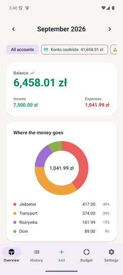
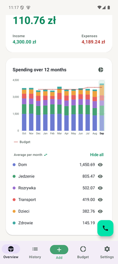
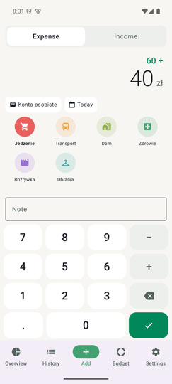
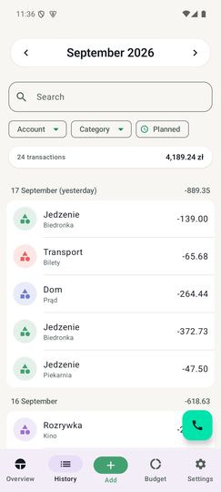
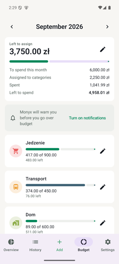
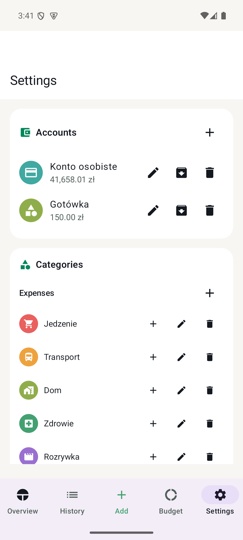

<p align="center">
  
</p>

<h1 align="center">Monyx</h1>

<p align="center">
  A shared household budget app for one family. Native Android, backend on
  Telnyx Edge Compute.<br>
  English and Polish interface, switchable in Settings.
</p>

## Screenshots

<table>
  <tr>
    <td align="center" width="16%"></td>
    <td align="center" width="16%"></td>
    <td align="center" width="16%"></td>
    <td align="center" width="16%"></td>
    <td align="center" width="16%"></td>
    <td align="center" width="16%"></td>
  </tr>
  <tr>
    <td align="center"><b>Summary</b><br>the launch screen</td>
    <td align="center"><b>12 months</b><br>the same card, turned over</td>
    <td align="center"><b>Add</b><br>keypad and calculator</td>
    <td align="center"><b>History</b><br>search and filter</td>
    <td align="center"><b>Budget</b><br>plan and limits</td>
    <td align="center"><b>Settings</b><br>accounts, categories</td>
  </tr>
</table>

The app opens on the summary. Add is in the middle of the bottom bar, or one
long-press on the launcher icon from the home screen; saving lands on the ledger
with the new row on screen.

- **Summary** — what the chosen month earned, spent, and the difference between
  them, filtered by account. Tapping it turns the card over to show the last
  thirty days as a line and what is actually in the accounts, which is a
  position rather than a month. The breakdown card has two faces as well: this
  month as a pie, or the last twelve months as stacked bars by category, with
  the budget drawn over them as a red line so a month that went over is one you
  can see. Tapping a bar moves the whole screen to that month. The legend gives
  each category's monthly average — over the months the ledger actually covers —
  or that one month's spending, whichever you switched it to last; it re-sorts
  itself to match, and remembers the choice. The eye at the end of a row hides
  the category from the chart; what is hidden sinks to the bottom and stays
  hidden on that phone alone, across launches.
- **Add** — a keypad that is also a calculator, a note, any date including the
  future, and *Make it repeat* to turn the row being typed into a repeating rule.
- **History** — the month, searchable, filtered by account, category and then
  subcategory, with the filtered rows totalled above them so "how much went on
  coffee" is a figure rather than an addition. Pulled down to sync. Today and
  yesterday are labelled as such, and *Planned* shows
  what the repeating rules are about to write.
- **Budget** — what there is to spend this month, limits on main categories that
  carry forward until changed, and a warning before a limit is passed rather than
  after. A limit of zero is a limit: it means nothing may go here, which is not
  the same as having set none.
- **Settings** — accounts, categories (two levels, dragged into order), repeating
  rules, language, backup health, the update check and what every release
  changed.

One month switcher, the same control in the same place on Summary, History and
Budget: three views of one month, not three months. The arrows step to a
neighbour; the title opens a picker for anything else.

Money moved between accounts is a transfer — no category, and never counted as
spending anywhere. A transaction is tapped to edit it; the editor is the add
screen again, with Delete behind a confirmation and the row's sync state on it.

Release builds offer their own updates: on launch when a newer version exists,
with the notes of every version skipped, or on demand from Settings › Advanced.

Interface English, category names Polish: the names are rows that sync to every
device, so they are data the family owns, not translated copy. Switching the
interface language does not rename anyone's categories, though the app itself is
called Portfel on a Polish phone.

Captured on an emulator against a local database of demo data — not the
family's own numbers.

## Layout

```
monyx/
├── server/          Telnyx Edge Compute function (TypeScript)
├── android/         The app (Kotlin, Compose, Room)
├── scripts/         One-off operational scripts
└── docs/decisions/  ADRs — written when something surprised us
```

## Prerequisites

- Node ≥ 22.5 (for `node:sqlite` and `node --test`)
- `telnyx-edge` CLI ≥ 0.5.0 — below that the `sqldb` surface differs
- JDK 17+ and the Android SDK (platform 35, build-tools 35) for the app
- `JAVA_HOME` and `ANDROID_HOME` exported — Gradle, `apksigner` and the release
  script all need them, and macOS's `/usr/bin/java` stub answers "Unable to
  locate a Java Runtime" rather than falling back to anything

## Server

```sh
cd server
npm install
npm test          # 103 tests: sync, auth, budgets, voice, notes, releases
npm run typecheck
telnyx-edge ship  # deploy
```

Bindings live in `telnyx.toml` and are read via
`import { env } from "@telnyx/edge-runtime"` — **never** off the second argument
to `fetch(req, env)`, which type-checks cleanly and is `undefined` at runtime.

### Schema changes

Migrations are numbered and untouchable once applied. A fix is a **new file**,
never an edit to an old one.

```sh
telnyx-edge storage sqldb migrations apply monyx --remote --migrations-dir server/migrations
```

### Creating a household

There is no endpoint that creates a household — enrolment consumes an invite, it
does not bootstrap. Use the script, which seeds the default categories and
accounts and mints the first invite code in one go:

```sh
node scripts/new-household.mjs "Dom"            # Polish seed names
node scripts/new-household.mjs "Home" --lang en  # English seed names
```

`--lang` picks the language of the SEED ROWS only, and only once. Category and
account names are data that syncs to every device; the in-app language picker
changes the interface around them, not the names themselves. That is deliberate
— the family renames these anyway, and a rename must not be undone by somebody
else switching language.

It prints the `household_id` and an invite code valid for 24 hours. Type that
code into the app's onboarding screen. After that, any enrolled phone can mint
further invites from Settings.

## Android

Set the backend address in an ignored `android/backend.properties` file:

```properties
apiUrl=https://your-backend.example.com
```

Alternatively, export `MONYX_API_URL`; it takes precedence over the file and
works for CI builds too. A missing or invalid URL stops the build with a setup
error. Use HTTPS, without credentials, query parameters or a fragment; trailing
slashes are removed. The address is compiled into the APK, so changing it requires
a rebuild. Keeping it outside Git does not make it a secret on an installed phone.

The deployed smoke test also requires `MONYX_API_URL` or an explicit `--url`:

```sh
node scripts/smoke-test.mjs <invite_code> --url https://your-backend.example.com
```

This test enrolls devices and writes test data; use a test household.

```sh
cd android
./gradlew assembleDebug     # use the wrapper: it pins Gradle 8.11.1, and
                            # AGP 8.7.3 does not support Gradle 9
./gradlew assembleRelease   # signed, R8-minified, shrinkResources on
```

Debug builds carry `applicationIdSuffix ".debug"` so a debug and a release build
coexist on one phone. Without it the eventual release install fails with
`INSTALL_FAILED_UPDATE_INCOMPATIBLE`, and the only way through is an uninstall
that destroys local data.

The version is semver. `versionName` is `-PmonyxVersion`, which the release
script passes, or else the newest `v*` tag, or else `0.0.0`. `versionCode` is
derived from it as `major * 1_000_000 + minor * 1_000 + patch`. **Android refuses
any APK whose versionCode is lower than the installed one**, so a bad release
cannot be rolled back without an uninstall. Settings shows the version, so
"which build do you have?" is answerable over the phone.

### Publishing an update

```sh
node scripts/release.mjs --bump patch --note "Po zapisaniu otwiera się lista transakcji."
node scripts/release.mjs --bump minor --notes-file notes.txt --dry-run   # every check, no upload
node scripts/release.mjs --version 2.0.0 --notes-file notes.txt --skip-build  # reuse the built APK
node --test scripts/*.test.mjs   # the version, notes and pruning rules
```

Needs `TELNYX_API_KEY`, or a `~/.telnyx-edge/config.toml` from `telnyx-edge
login`; `--db` names a database other than `monyx`.

`--bump major|minor|patch` counts from the newest published release; `--version`
names the version outright. Each `--note`, or each line of `--notes-file`, is one
bullet in the update dialog.

Builds the release, checks it is signed with the release certificate, uploads it
to the private `monyx-releases` bucket, reads it back and compares sha256, and
only then writes the `app_releases` row. Then it tags the commit `v<version>`
(push the tag yourself) and deletes every APK from the bucket except this release
and the one before it. Installed release builds offer it on their next launch;
Settings › Advanced can check on demand. **The tree must be committed first**,
because the tag has to describe what shipped. A version at or below the latest
published one is refused, because no phone could install it. Withdraw a release
by deleting its row. Phones not yet updated are then offered the previous
release, whose APK is still in the bucket. See ADRs
[0020](docs/decisions/0020-the-app-updates-itself-and-asks-first.md) and
[0021](docs/decisions/0021-releases-are-semver-and-the-bucket-keeps-two.md).

### The release keystore

`android/keystore.properties` (git-ignored) points at `~/.monyx/monyx-release.jks`.

The release script pins that certificate's SHA-256 (`RELEASE_CERT_SHA256` in
`scripts/release.mjs`) and refuses to publish anything signed with another key,
so rotating the keystore means editing that constant in the same commit.

**Back up both the keystore and its password somewhere that survives a laptop
dying.** Android refuses an update signed with a different key than the installed
build. Losing the keystore means every phone must uninstall and reinstall,
losing anything not yet synced.

## Languages

English is the source and the default (`res/values/`); Polish is a translation
(`res/values-pl/`). Settings › Language offers System default, English, Polski.

Adding a language means three places, and missing any one of them fails quietly
in a different way:

1. `res/values-<tag>/strings.xml` — miss it and the language cannot be shown.
2. `res/xml/locales_config.xml` — miss it and Android's own per-app language
   list will not offer it.
3. `Locales.SUPPORTED` in `android/app/src/main/java/com/monyx/Locales.kt` —
   miss it and the in-app picker will not list it.

Selection goes through `AppCompatDelegate.setApplicationLocales`, not a
preference of our own. On API 33+ that forwards to the framework `LocaleManager`
so the choice also appears in system settings; below 33 AppCompat stores it
itself, which is what the `autoStoreLocales` meta-data in the manifest switches
on. This is why `MainActivity` is an `AppCompatActivity` and the XML theme
parent is an AppCompat one — a plain `ComponentActivity` would store the
preference and then ignore it.

**Money and dates follow the interface language; the currency and the timezone
do not.** Polish prints `5 127,00 zł` (non-breaking space, comma decimal),
English `5,127.00 zł`. But złoty is złoty in both, and `Dates.ZONE` stays
`Europe/Warsaw` because that is where the household lives, not what it reads.
The formatters in `Money.kt` are cached against the locale that built them
rather than held in a `val`: switching language does not restart the process,
and a formatter built at class-init would keep printing the old language.

## Scheduling and backup

Nothing in this repository runs on a schedule. `POST /cron/daily` exists and is
guarded by the `CRON_SECRET` secret; it sweeps the budget alerts the push path
cannot see — a month boundary, a limit revised downward, a delivery that failed
while a phone was offline. Something outside the function has to call it, and
today nothing does.

Backups are manual for a harder reason: `sqldb export` is CLI-only, with no REST
equivalent, so the function cannot dump its own database.

```sh
telnyx-edge storage sqldb export monyx --remote --output monyx-$(date -u +%Y%m%d).sql
curl -X POST "$MONYX_API_URL/cron/daily" \
  -H "x-cron-secret: $CRON_SECRET" -H 'content-type: application/json' \
  -d "{\"last_backup_at\": $(date -u +%s)000}"
```

Reporting `last_backup_at` is what makes a missed backup visible: the app reads
it and Settings warns when it is more than three days old. An invisible backup
is not a backup.

**Do not treat the phones as the backup.** `epoch` and the `households` row live
on the server, so if the database is lost no phone can authenticate to re-upload
its replica. The data survives locally, but recovery means seeding a fresh
household and re-enrolling every device by hand.

## Voice

Two different things share the word, and they do not touch each other. **Adding
by voice happens on the phone**, on-device, with no network and no Telnyx route
of any kind. **Asking about the month happens over the line**, through the call
button, and that path only ever reads.

### Adding by voice — on the phone

Hold the Add tab in the bottom bar until it buzzes, then say "dodaj 200 na
transport" or "add 200 to Transport". The row is written and a sheet shows what
it wrote — amount, category, account, day and note — with every field a tap into
the editor, and **Anuluj** takes it back. Corrections can be spoken too: "ma być
250", "zmień kategorię na zakupy".

Whatever is left once the amount, the date and the category have claimed their
words becomes the note: "150 zł na zakupy w Biedronce" files 150,00 under Zakupy
spożywcze with the note *Biedronka*.

**The transaction never leaves the phone to be understood.** Speech is Android's
own `SpeechRecognizer`, asked to prefer the on-device pack; the parse is a few
hundred lines of Kotlin in `android/app/src/main/java/com/monyx/voice/`, pure
and unit-tested on the JVM. It works with the phone in flight mode.

One thing does leave: after the row is saved, the transcript is sent to
`POST /voice/note` to see whether the note could be written better. It is worth
being plain about the price — a sentence the household said out loud goes to a
third party, it is billed per call, and it does nothing offline. What makes it
acceptable is that it is not in the add path at all: the row is written and the
summary is on screen before the call is made, the answer is used only if it
arrives while that sheet is still open, and a phone with no signal gets the note
its own rules wrote.
[ADR 0019](docs/decisions/0019-the-microphone-is-the-phones-not-the-lines.md)
argues all of it, including the on-device model that was built first and set
aside because it needed a multi-gigabyte download.

What it cannot finish, it does not write: a sentence with an amount but no
category opens the keypad with the amount already in it, and two transactions in
one breath are refused rather than blended into one wrong row. A tie between two
category names is a refusal rather than a guess, because a wrong row syncs to
everybody. A phone with no recognition service simply has no gesture.

`RECORD_AUDIO` is asked for on the first long press and never before it, which
is the one deliberate exception to the rule in `NotificationPermission.kt` that
forbids a permission dialog in the add path. The keypad path is untouched.

### Asking about the month — over the line

The household can be asked about over the phone. The assistant itself — model,
voice, transcription, instructions, and the number it answers — is configuration
held on Telnyx AI Assistants and is not in this repository. What is here is the
only part it cannot do alone: two read-only routes, because `env.DB` is bound to
the function and there is no public SQL API.

| Route | When | Returns |
|---|---|---|
| `POST /voice/context?t=…` | call setup | one XML snapshot of the month, straight into the prompt |
| `POST /voice/digest` | mid-call | the same snapshot again |
| `POST /voice/note` | after a voice entry saves | a better note for it, or nothing |

The third is not part of the assistant at all — it belongs to voice entry on the
phone, carries a device session rather than a shared secret, and touches no
database. It is listed here because it is the other place this codebase sends
text to a model.

**The allowlist is the only gate.** Caller ID is not a credential, so a spoofed
number reaches the household's finances. That is a deliberate trade and
[ADR 0018](docs/decisions/0018-the-assistant-gets-a-window-not-a-key.md) argues
it: a PIN and a preload are mutually exclusive, because a secret placed in a
prompt cannot be withdrawn from it, and the preload is what makes the first
question of a call cost nothing.

Three secrets, none of them in this repository:

- `VOICE_ALLOWLIST` — JSON `[{msisdn, household_id, name}]`. Who may call and
  which household they reach. A secret rather than a table because phone numbers
  are personal data. It fails closed: a value that will not parse admits nobody.
- `VOICE_CONTEXT_TOKEN` — travels in the call-setup URL, which is the only place
  the assistant's webhook field allows a secret.
- `VOICE_TOOL_SECRET` — the `x-voice-secret` header on the tool webhook, held on
  the Telnyx side as an integration secret.

`POST /voice/note` needs no secret of its own. It reaches the model through
`env.TELNYX`, the client the `[telnyx]` binding in `telnyx.toml` puts on the
environment; the runtime's auth proxy substitutes the real bearer as the request
leaves the pod, so the function is authenticated as itself and there is no
account-wide key anywhere in this repository, in a secret store, or in memory.
Nothing to rotate and nothing to leak. Absent the binding, the route answers
"keep the note you have" and nothing breaks.

Two of the three routes are `SELECT`-only and stayed that way when adding by
voice was built. The third, `POST /voice/note`, is stronger still: it has no
database binding at all, because it is a text transform, and a test fails if a
database import ever appears in it. What ADR 0018 left open — a
server-side write, which needs a `created_by` member with no device — is still
open, and is now unnecessary. See
[ADR 0019](docs/decisions/0019-the-microphone-is-the-phones-not-the-lines.md).

**The app has a call button** — a floating action button, bottom right, in
Telnyx green, on every tab but the keypad, where the bottom right is already the
save button. It is a different feature from the one above: it asks about the
month, and it does not write to it.

It fires `ACTION_DIAL` rather than `ACTION_CALL`: dialling fills the number in
and lets the person press call themselves, where calling would need the
`CALL_PHONE` permission to place an outgoing call from under their thumb, to
save one tap. The number comes from `BuildConfig.ASSISTANT_NUMBER`, read from an
untracked `android/voice.properties`:

```properties
assistantNumber=+00000000000
```

Absent, the constant is empty and the button hides itself, so a clean checkout
builds and simply has no call button rather than one that dials nowhere. A phone
number is personal data and does not belong in the repository, which is the same
reason `VOICE_ALLOWLIST` is a secret.

To check the routes are alive without placing a call:

```sh
curl -s -o /dev/null -w '%{http_code}\n' -X POST "$MONYX_API_URL/voice/context?t=wrong" \
  -H 'content-type: application/json' -d '{}'          # expect 401
curl -s -X POST "$MONYX_API_URL/voice/digest" \
  -H "x-voice-secret: $VOICE_TOOL_SECRET" -H 'content-type: application/json' \
  -d '{"ticket":"nope"}'                                # expect session_expired
```

## Restore runbook

The middle step is why `epoch` exists. Skipping it is worse than not restoring
at all: `next_seq` rewinds below every device's cursor, all four phones pull
nothing forever, and the household silently splits into four divergent
single-user apps while every screen still looks perfectly normal.

1. **Restore the export.** A SQL script over `execute --remote --file` is capped
   at roughly 4 MiB, so split a large dump into chunks:
   ```sh
   node scripts/restore.mjs backups/monyx-YYYYMMDD.sql
   ```
2. **Bump the epoch.** Every device notices on its next pull, resets its cursor
   and re-pulls from scratch.
   ```sh
   telnyx-edge storage sqldb execute monyx --remote \
     --command "UPDATE households SET epoch = epoch + 1 WHERE id = ?" --param <household_id>
   ```
3. **Ask ONE recently-online phone** to tap *Re-upload everything* /
   *Wyślij wszystko ponownie* in Settings. Whatever the restore lost is still on the phones; this is what sends
   it back. One phone covers everything — asking all four means four times the
   pushes serialising on the same `households` row and every phone then pulling
   four redundant copies of every row. Ask a second phone only if rows are still
   missing.

Test this with two phones already syncing, against a realistically sized dump —
not ten rows against a fresh install. The `epoch` failure only appears when live
cursors exist, and the 4 MiB ceiling only appears at real size.

## What is deliberately not here

No multiple currencies, no debts or savings goals, no bank integration, no
Excel export, no iOS, no web.
